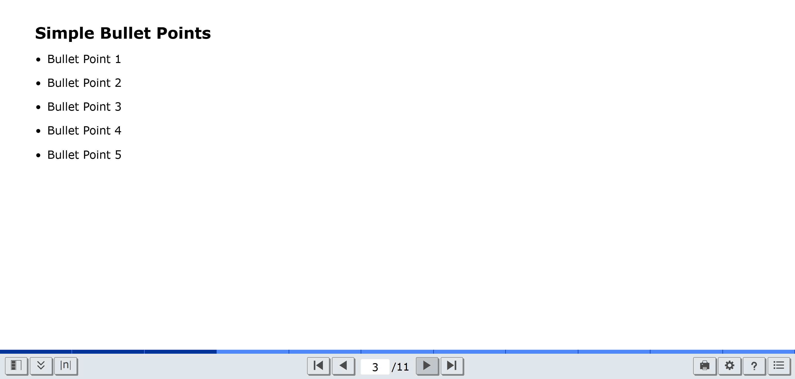
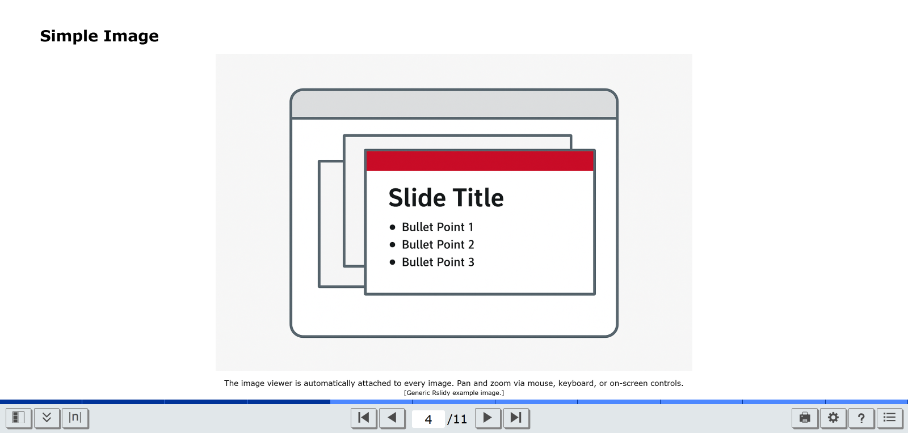
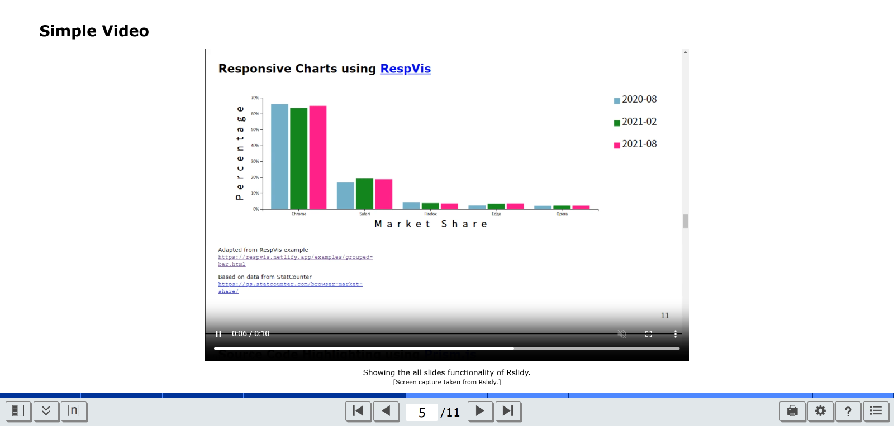
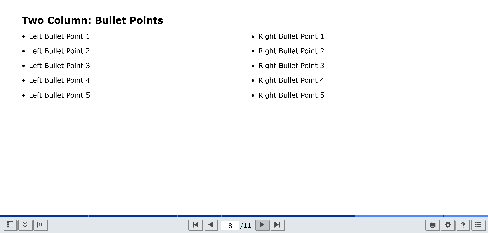
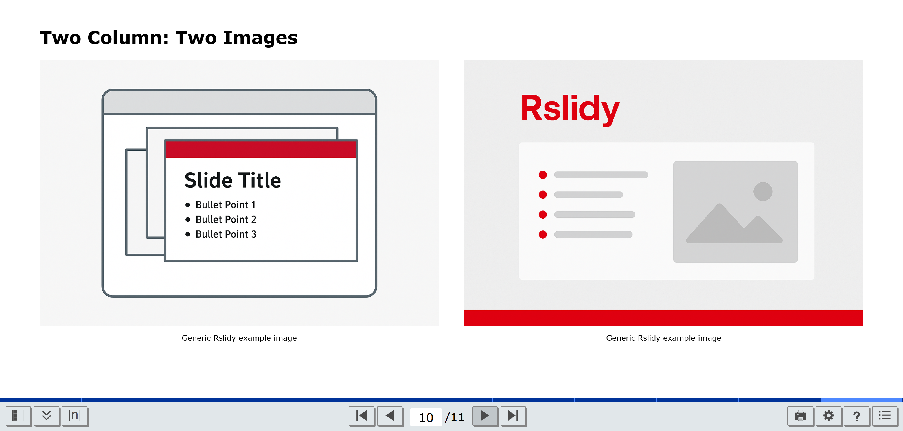

# Rslidy Layouts

This guide demonstrates the main layout options available in
Rslidy, based on provided templates. It covers a title slide,
simple slide layouts and multi-column layouts.


## 1. Title Slide

Use the `rslidy-titleslide` class for an opening slide.
You can also add a licence using a `<div>` with the id `licence`.

```html
<section class="rslidy-titleslide">
<h1>Rslidy Layouts</h1>
<h2>Title Slide</h2>
<h3>Graz University of Technology, Austria</h3>

<div id="rslidy-licence">
  <p>
    © Copyright 2025 by the author(s), except as otherwise
    noted.<br/>
    This work is placed under a Creative Commons Attribution
    4.0 International
    (<a href="https://creativecommons.org/licenses/by/4.0/">
    CC BY 4.0</a>) licence.
  </p>
</div>
</section>
```


## 2. Section Slide

Use the `rslidy-sectionslide` class for centered section divider 
slide, to separate presentation chapter.

```html
<section class="rslidy-sectionslide">
  <h1>Simple Slide Layouts</h1>
</section>
```


## 3. Simple Slide Layouts with Content Elements

Basic layouts for slides featuring text, bullet points, images, 
videos, or responsive tables in a clear single-column design.


### 3.1 Simple Bullet Points
Simple slide with an unordered bullet list.

```html
<section>
  <h1>Simple Bullet Points</h1>
  <ul>
    <li>Bullet Point 1</li>
    <li>Bullet Point 2</li>
    <li>Bullet Point 3</li>
    <li>Bullet Point 4</li>
    <li>Bullet Point 5</li>
  </ul>
</section>
```


[Rslidy Slide Deck](https://tugraz-isds.github.io/rslidy/rslidy/index.html)


### 3.2 Single Image
Insert a responsive image that supports pan and zoom
interactions using the `rslidy-large-images` or `rslidy-images` class.
The class `rslidy-images` displays centred images up to 15 em, 
while the class `rslidy-large-images` is used for images up to 25 em.
```html
<section>
  <h2>Single Image</h2>
  <figure>
    <div class="rslidy-large-images">
      
    </div>
    <figcaption>
      The image viewer is automatically attached to every
      image.<br/>
      Pan and zoom via mouse, keyboard, or on-screen
      controls.<br/>
      <span class="credit">Screen capture taken from Rslidy.
      </span>
    </figcaption>
  </figure>
</section>
```

[Rslidy Slide Deck](https://tugraz-isds.github.io/rslidy/rslidy/index.html)


### 3.3 Single Video

Embed a video using the same structure as image slides.
When wrapped in .rslidy-images or .rslidy-large-images, videos scale 
responsively while maintaining their aspect ratio.

```html
<section>
  <h2>Single Video</h2>
  <figure>
    <div class="rslidy-large-images">
      <video controls autoplay muted loop
             poster="images/all-slides.gif">
        <source src="images/image-viewer.mp4"
                type="video/mp4"/>
        
      </video>
    </div>
    <figcaption>
      Showing the image viewer as an mp4 video.<br/>
      <span class="credit">Screen capture taken from Rslidy.
      </span>
    </figcaption>
  </figure>
</section>
```

[Rslidy Slide Deck](https://tugraz-isds.github.io/rslidy/rslidy/index.html)


### 3.3 Responsive Table
Use the `rslidy-responsive-table` class to create a responsive, 
sortable table that adapts to any screen size. Combine it with
`rslidy-fit` for automatic font size scaling, or the class `zebra` for 
alternating row colours. The `rslidy-text` class left-aligns text 
content, while `rslidy-numeric` right-aligns numbers for easier 
comparison.
This responsive table also adds header labels 
as data-label attributes to each cell, ensuring that table data 
remains clearly labelled in the mobile stacked layout.
```html
<section>
  <h1>Responsive Table with Sorting: Smartphone Features Comparison
    (2025)</h1>
  <table class="rslidy-responsive-table rslidy-fit">
    <thead>
    <tr>
      <th scope="col" class="rslidy-text">Smartphone</th>
      <th scope="col" class="rslidy-text">Operating System</th>
      <th scope="col" class="rslidy-numeric">Battery (mAh)</th>
      <th scope="col" class="rslidy-numeric">Display Size (″)</th>
      <th scope="col" class="rslidy-numeric">Storage (GB)</th>
      <th scope="col" class="rslidy-numeric">Price ($)</th>
      <th scope="col" class="rslidy-text">Release Date</th>
    </tr>
    </thead>
    <tbody>
    <tr>
      <td class="rslidy-text">Samsung Galaxy</td>
      <td class="rslidy-text">Android</td>
      <td class="rslidy-numeric">5000</td>
      <td class="rslidy-numeric">6.8</td>
      <td class="rslidy-numeric">512</td>
      <td class="rslidy-numeric">1199</td>
      <td class="rslidy-text">2025-03-15</td>
    </tr>
    <tr>
      <td class="rslidy-text">iPhone</td>
      <td class="rslidy-text">iOS</td>
      <td class="rslidy-numeric">4500</td>
      <td class="rslidy-numeric">6.7</td>
      <td class="rslidy-numeric">512</td>
      <td class="rslidy-numeric">1399</td>
      <td class="rslidy-text">2025-09-22</td>
    </tr>
    <tr>
      <td class="rslidy-text">Xiaomi</td>
      <td class="rslidy-text">Android</td>
      <td class="rslidy-numeric">4800</td>
      <td class="rslidy-numeric">6.7</td>
      <td class="rslidy-numeric">256</td>
      <td class="rslidy-numeric">899</td>
      <td class="rslidy-text">2025-02-28</td>
    </tr>
    <tr>
      <td class="rslidy-text">Oppo Find</td>
      <td class="rslidy-text">Android</td>
      <td class="rslidy-numeric">4600</td>
      <td class="rslidy-numeric">6.7</td>
      <td class="rslidy-numeric">256</td>
      <td class="rslidy-numeric">999</td>
      <td class="rslidy-text">2025-05-10</td>
    </tr>
    <tr>
      <td class="rslidy-text">Vivo</td>
      <td class="rslidy-text">Android</td>
      <td class="rslidy-numeric">4700</td>
      <td class="rslidy-numeric">6.8</td>
      <td class="rslidy-numeric">512</td>
      <td class="rslidy-numeric">849</td>
      <td class="rslidy-text">2025-07-05</td>
    </tr>
    <tr>
      <td class="rslidy-text">Realme</td>
      <td class="rslidy-text">Android</td>
      <td class="rslidy-numeric">4500</td>
      <td class="rslidy-numeric">6.7</td>
      <td class="rslidy-numeric">256</td>
      <td class="rslidy-numeric">749</td>
      <td class="rslidy-text">2025-04-18</td>
    </tr>
    <tr>
      <td class="rslidy-text">Huawei</td>
      <td class="rslidy-text">HarmonyOS</td>
      <td class="rslidy-numeric">5000</td>
      <td class="rslidy-numeric">6.8</td>
      <td class="rslidy-numeric">512</td>
      <td class="rslidy-numeric">1099</td>
      <td class="rslidy-text">2025-06-01</td>
    </tr>
    <tr>
      <td class="rslidy-text">Motorola</td>
      <td class="rslidy-text">Android</td>
      <td class="rslidy-numeric">4400</td>
      <td class="rslidy-numeric">6.5</td>
      <td class="rslidy-numeric">256</td>
      <td class="rslidy-numeric">699</td>
      <td class="rslidy-text">2025-08-12</td>
    </tr>
    <tr>
      <td class="rslidy-text">Google Pixel</td>
      <td class="rslidy-text">Android</td>
      <td class="rslidy-numeric">4350</td>
      <td class="rslidy-numeric">6.4</td>
      <td class="rslidy-numeric">256</td>
      <td class="rslidy-numeric">799</td>
      <td class="rslidy-text">2025-01-30</td>
    </tr>
    </tbody>
  </table>
</section>
```

[Rslidy Slide Deck](https://tugraz-isds.github.io/rslidy/rslidy/index.html)


## 4. Multi-Column Layouts

Layouts that split slides into multiple columns for balanced 
side-by-side content.
Use the `rslidy-columns-even` class to create two equally wide columns 
for parallel content.
The `rslidy-left-column` and `rslidy-right-column` classes define 
structure and spacing.

### 4.1 Two-Columns Bullet Points

Divide the slide into two evenly sized columns with bullet points on 
both sides.

```html
<section>
  <h1>Two-Columns Bullet Points</h1>
  <div class="rslidy-columns-even">
    <div class="rslidy-left-column">
      <ul>
        <li>Left Bullet Point 1</li>
        <li>Left Bullet Point 2</li>
        <li>Left Bullet Point 3</li>
        <li>Left Bullet Point 4</li>
        <li>Left Bullet Point 5</li>
      </ul>
    </div>
    <div class="rslidy-right-column">
      <ul>
        <li>Right Bullet Point 1</li>
        <li>Right Bullet Point 2</li>
        <li>Right Bullet Point 3</li>
        <li>Right Bullet Point 4</li>
        <li>Right Bullet Point 5</li>
      </ul>
    </div>
  </div>
</section>
```


[Rslidy Slide Deck](https://tugraz-isds.github.io/rslidy/rslidy/index.html)


### 4.2 Bullet Points Left – Image Right

Combine Bullet Points on the left with an image on the right.

```html
<section>
  <h1>Two Column: Bullets Left - Image Right</h1>
  <div class="rslidy-columns-even">
    <div class="rslidy-left-column">
      <ul>
        <li>Bullet Point 1</li>
        <li>Bullet Point 2</li>
        <li>Bullet Point 3</li>
        <li>Bullet Point 4</li>
        <li>Bullet Point 5</li>
      </ul>
    </div>
    <div class="rslidy-right-column">
      <figure>
        <div class="rslidy-images">
          
        </div>
        <figcaption>Rslidy: Example slide.</figcaption>
      </figure>
    </div>
  </div>
</section>
```


[Rslidy Slide Deck](https://tugraz-isds.github.io/rslidy/rslidy/index.html)


### 4.3 Two Column: Two images

Display images side-by-side.

```html
<section>
  <h1>Two Image Layout</h1>
  <div class="rslidy-columns-even">
    <div class="rslidy-left-column">
      <figure>
        <div class="rslidy-images">
          
        </div>
        <figcaption>Rslidy: Example slide.</figcaption>
      </figure>
    </div>
    <div class="rslidy-right-column">
      <figure>
        <div class="rslidy-images">
          
        </div>
        <figcaption>Rslidy: Example slide 2.</figcaption>
      </figure>
    </div>
  </div>
</section>
```


[Rslidy Slide Deck](https://tugraz-isds.github.io/rslidy/rslidy/index.html)


### 4.4 Two Column: One Image - One Video

Example with an image on the left and a video on the right.

```html
<section>
  <h1>One Image - One Video</h1>
  <div class="rslidy-columns-even">
    <div class="rslidy-left-column">
      <figure>
        <div class="rslidy-large-images">
          
        </div>
        <figcaption>Rslidy: Example slide.</figcaption>
      </figure>
    </div>
    <div class="rslidy-right-column">
      <figure>
        <div class="rslidy-large-images">
          <video controls autoplay muted loop
                 poster="images/all-slides.gif">
            <source src="images/image-viewer.mp4"
                    type="video/mp4"/>
            
          </video>
        </div>
        <figcaption>
          Showing the image viewer as an mp4 video.<br/>
          <span class="credit">Screen capture taken from
          Rslidy.</span>
        </figcaption>
      </figure>
    </div>
  </div>
</section>
```


[Rslidy Slide Deck](https://tugraz-isds.github.io/rslidy/rslidy/index.html)

