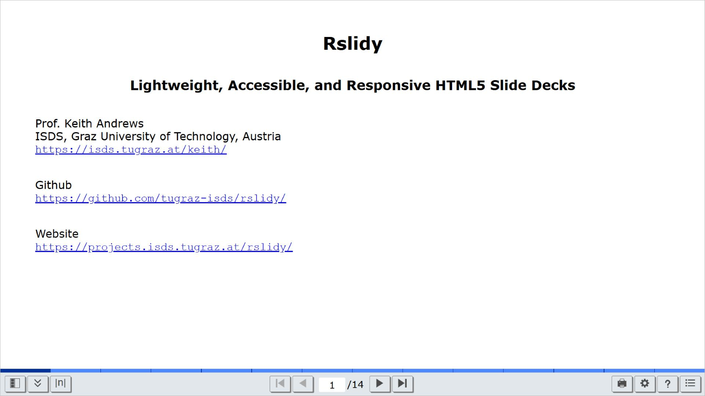

# Rslidy

Rslidy: Lightweight, accessible, and responsive HTML slide decks.


## 1 Introduction

Rslidy is a presentation tool using HTML, CSS, and TypeScript which
runs directly inside the web browser. Slides are created within
`<section>` elements inside the HTML `<body>` element and are
presented one at a time with transitions.



[Example Rslidy Slide Deck](https://tugraz-isds.github.io/rslidy/rslidy/index.html)


## 2 Features

Rslidy has the following features:
- Standard HTML elements to create slides.  
[For an introduction to HTML and CSS, see
[HTML Dog](https://htmldog.com/)
or [web.dev/html](https://web.dev/html)
and [web.dev/css](https://web.dev/css).]

- Slide navigation.
- Slide overview.
- Table of contents.
- Responsive design.
- Responsive interactions (including shake and tilt).
- Responsive tables.
- Image viewer (including zoom and pan).
- Slide templates.
- Extensive print functionality (to create PDF).
- Accessibility through ARIA roles.
- Live code can be embedded.


## 3 Examples

Live presentations and examples for different use cases of Rslidy 
can be seen at: https://tugraz-isds.github.io/rslidy/.

These examples showcase Rslidy’s features, design responsiveness, 
and interactive elements in action.


## 4 For Slide Creators

Slide creators are users who wish to create a slide deck using Rslidy.
For a complete and structured introduction on how to create slide
decks, see the [Rslidy Slide Creator
Guide](README-slide-creator-guide.md).


### 4.1 Structure of HMTL File

The creation of a slide deck with Rslidy is done in a single HTML file.

First, the HTML file must contain a header to include the files
`rslidy.css` and `rslidy.js` (or, alternatively, to save on download
size, their minimised versions `rslidy.min.css` and `rslidy.min.js`):
```html
<link rel="stylesheet" href="rslidy.css" />
<script src="rslidy.js" />
```
Rslidy is self-contained, there are no additional dependencies beyond
its own `rslidy.css` and `rslidy.js` files.


Slides are created within the body of the document. Each slide is
contained within a `<section>` element (or, alternatively, a `<div
class="slide">` element):

```html
<section>
<h1>Title of slide 1</h1>
<ul>
<li>First point</li>
<li>Second point</li>
<li>Third point</li>
</ul>
</section>

<section>
<h1>Title of slide 2</h1>
<p>
A paragraph of text.
</p>
</section>
```


### 4.2 Global CSS Variables

Rslidy defines a set of CSS custom properties in the file
`rslidy/src/css/_variables.css`, enabling theming and customisation.

For a full overview of all global variables and their usage, see
the [Rslidy CSS Variables Guide](README-variables.md).


### 4.3 Customising Slide Decks

Rslidy variables may be used globally or component-specifically via:


#### Lists

To organise slides, bullet points are created as shown in the
snippet below.

```html
<section>
<h1>Slide Heading</h1>
<ul>
<li>First point</li>
<li>Second point</li>
  <ol style="list-style-type: lower-alpha; padding-bottom: 0;">
    <li style="margin-left:3em">First subpoint of second point</li>
  </ol>
<li>Third point</li>
</ul>
</section>
```
To make list items appear one at a time, use the
`<ul class="rslidy-incremental">` instead of `<ul>`.

#### Images

The inclusion of images or other graphical elements works just like in
any other HTML file within slides using the standard HTML ``
element. The same counts for CSS style definitions. However, all CSS
definitions must be defined outside the body.  A possible inclusion of
a picture with a CSS might look as shown below:

```html
<style>
  img {
    display: block;
    margin-left: auto;
    margin-right: auto;
  }

  .imgContainer{
  float:left;
  }
</style>

<body>
  <section>
  <h1>Image Demo</h1>
  
  </section>
</body>
```

Rslidy's image viewer is automatically associated with every image.


#### Animated Slide Transitions

There are currently four transition types between slides:
- `slidein` (default)
- `fade`
- `zoom`
- `unanimated`

The desired transition type is added to the body element:

```html
<body class="fade">
```

```html
<body class="unanimated">
```


### 4.4 How to Share an Rslidy Presentation?

The easiest way of sharing a slide deck created with RSlidy is by
zipping the whole folder. However, when simplifying, the zipped folder
must contain under all circumstances the html file of the slide deck,
the file `rslidy.js` the file `rslidy.css` as well as all included
graphics. If `rslidy.min.css` or `rslidy.min.js` are used for the
presentation, they must be included instead or additionally to the
unminimised version of the files. Sharing only the HTML file on its
own is not sufficient!


In the current build system, the minified ESM version `rslidy.min.js` is
automatically copied into every example and test folder, since this format is
the recommended standard. ESM modules must be served over HTTP(S) and
cannot be opened directly from a local file system. You can quickly start a
local development server in any directory, for example using Python:

```
python3 -m http.server 8000
```


### 4.5 Rslidy Layouts

The [Rslidy Layouts Guide](README-layouts.md) provides an overview of
the various layout options available for creating slide decks in
Rslidy.  It demonstrates how to use templates or classes to design
title slides, section dividers, content slides (with text, lists,
images, videos, and responsive tables), as well as multi-column
layouts.


## 5 For Slide Viewers

Slide viewers are users who view or present slide decks created with
Rslidy. For a complete description of viewer controls, shortcuts,
interaction features and settings, see the [Rslidy Slide
Viewer Guide](README-slide-viewer-guide.md).


Rslidy presentations can be operated using keyboard, mouse, or touch
input. Navigation is available through on-screen controls, keyboard
shortcuts, a slide overview and table of contents for direct access
to individual slides.

Rslidy also supports responsive interaction techniques such as swipe
gestures, margin tapping, and tilt and shake navigation on
supported devices. Presentation features include adjustable content and
user interface font sizes, speaker notes and a built-in image viewer. 
Slide decks can be exported as PDF documents via a print menu.


## 6 For Developers

Developers are users who wish to modify Rslidy and build it from
source. For a complete description of the build stages and generated
artefacts, see the [Rslidy Developer
Guide](README-developer-guide.md).


### 6.1 Prerequisites

- Node.js (version 16 or higher)

- pnpm, which can be installed using npm (recommended):
  ```
  npm install -g pnpm
  ```


### 6.2 Installation

To install and build Rslidy from source, use the following command:
```
git clone git@github.com:tugraz-isds/rslidy.git
```
In the `rslidy/` folder, install the project dependencies with:
```
pnpm install
```


### 6.3 Building

Rslidy can be built with the command:
```
pnpm exec gulp build
```
The `rslidy/build/` folder then contains Rslidy's main files, as
well as some example presentations, which can be copied and adapted to
create new slide decks.


There is also a gulp task `gulp watch`, which uses Browsersync
to provide a more convenient development environment:
```
pnpm exec gulp watch
```

This task initiates a rebuild and synchronises the browser every time
a source files changes.

A specific slide deck folder can be served using the `--slide` (or `-s`) flag:
```
pnpm exec gulp watch --slide examples/Layouts
```
or
```
pnpm exec gulp watch --slide tests/stress-test
```
The argument must refer to a folder within either the `examples/` or `tests/`
directory. The task automatically serves the `index.html` file 
inside that folder. If no argument is provided, the default deck
`examples/layouts/` is used.


### 6.4 Updating Icons

To commit changes from the icons located in `src/icons/` to Rslidy, the
following gulp task has to be run:

```
pnpm exec gulp icons
```

This creates or updates the file `src/ts/icon-definitions.ts` with
optimised SVG icon strings.


## 7 Rslidy Team

The following people have contributed to Rslidy:

- Keith Andrews
  [kandrews@iicm.edu](mailto:kandrews@iicm.edu?subject=Rslidy)  
  Project Leader

- Fabian Platzer  
  Master's Thesis, main developer

- Patrick Hipp  
  Master's Thesis, original developer

- Christopher Kopel  

- Gsellmann Inge, Heider Martin, Leitner Lukas, Patel Vrutanjali Rakesh  
  IAweb WS 2023 G1

- Angelika Droisner, Ana Korotaj  
  IAweb WS 2018 G1a

- Thomas Eibl, Michael Glatzhofer, Christoph Heidenreich, Verena Schiffer  
  IAweb WS 2017 G1

- Rok Kogovšek, Alexei Kruglov, Fernando Pulido Ruiz, Helmut Zöhrer  
  IAweb WS 2016 G5

- Markus Schofnegger  
  Bachelor's Thesis, 02 Nov 2015

- Filippo Garolla, Sabine Lukas, Matthias Schlesinger, Karin Wilding  
  IAweb WS 2014 G1

- Elias Zeitfogel, Patrick Kasper, Karina Priebernig, Clemens Meinhart  
  IAweb WS 2013 G4


