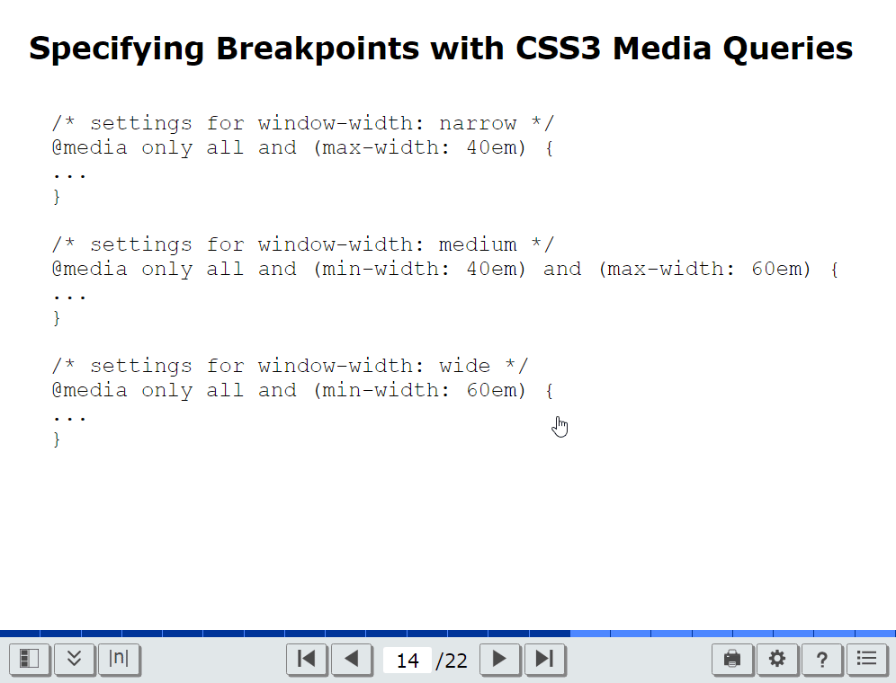

# Rslidy

Rslidy: Lightweight, accessible, and responsive HTML5 slide decks.




## 1 Introduction

Rslidy is a presentation tool using HTML5, CSS3, and TypeScript which
runs directly inside the web browser. Slides are created within sections
inside the HTML5 body element and are presented one at a time with
transitions.


## 2 Features

- Use standard HTML5 elements to create slides.
For an introduction to HTML5, see
[HTML Dog](https://htmldog.com/)
or
[HTML5 Intro](https://w3schools.com/html/html5_intro.asp).

- Slide navigation.
- Slide overview.
- Table of contents.
- Responsive design.
- Responsive interactions (incl. shake and tilt).
- Image viewer (incl. zoom and pan).
- Support for CSS styles:
  - Animations
  - Fonts
  - Colours
- Accessibility through ARIA roles.
- Live code can be embedded.


## 3 Installation and Setup

Download the latest binary release
[here](https://github.com/tugraz-isds/rslidy/releases/latest).


To install and build Rslidy from source, use the following commands:

```
git clone "https://github.com/tugraz-isds/rslidy.git"
```
Then, in the rslidy folder, run:

```
npm install
npx gulp
```

The `rslidy/build` folder will then contain Rslidy's main files, as
well as some example presentations, which can be copied and adapted to
create new slide decks.


### 3.1 For Slide Viewers

The Help Panel in a Rslidy presentation contains an overview of
Rslidy's interface controls.


### 3.2 For Slide Creators

#### How to create a Presentation

The creation of a slide deck with Rslidy is done in a single HTML file. 

##### Structure of the HMTL File 

To properly build the slide deck, the HTML file must contain a header 
including rslidy.js and rslidy.css. Alternatively, the minimized versions, rslidy.min.js 
and rslidy.min.css offer the same features in a compromised way and can be included instead.

```html
<link rel="stylesheet" href="rslidy.min.css" />
<script src="rslidy.js" />
```

Rslidy is self-contained, there are no additional dependencies.

Within the body of the document, the single files are created. Each slide is 
represented eighter by a `<section>` or a `<div class="slide">` element:

```html
<section>
<h1>Characteristics of Software</h1>
<p>
Three characteristics of software:
</p>
<ul>
<li>fast</li>
<li>cheap</li>
<li>good</li>
</ul>
<p>
Choose any two!
</p>
</section>
```

```html
<div class="slide">
<h1>Further Information</h1>
<p>
A paragraph of text.
</p>
</div>
```

##### Lists

```html
<section>
<h1>Slide Heading</h1>
<ul>
<li>First point</li>
<li>Second point</li>
<li>Third point</li>
</ul>
</section>
```
To make list items appear one at a time, use the
`<ul class="incremental">` instead of `<ul>`.


##### Animated Slide Transitions

There are currently four transition types between slides:
- `slidein` (default)
- `fade`
- `zoom`
- `unanimated`

The desired transition type is added to the body element:

```html
<body class="fade">
```

```html
<body class="unanimated">
```


##### Images

Images can be included within slides using the standard HTML ``
element:

```html
<section>
<h1>Image Demo</h1>

</section>
```

Rslidy's image viewer is automatically associated with every image.


#### Custom Settings

A number of internal Rslidy settings can be directly overridden using
JavaScript, as shown below:

```html
<script>
  window.rslidy.close_menu_on_selection = true;
  window.rslidy.close_navigation_on_selection = true;
  window.rslidy.start_with_status_bar_minimized = true;
  window.rslidy.image_viewer = false;
  window.rslidy.start_in_low_light_mode = true;
  window.rslidy.block_slide_text_selection = true;
  window.rslidy.show_slide_dividers = false;
</script>
```

For more information, see the example file `overrides.html`.


### 3.3 For Developers


#### The Build System
To build the project use:

```
npx gulp build
```
Build may be omitted, since it is the default gulp task.
There is also a gulp task using `Browsersync` and `gulp watch`
for more convenient development.

```
npx gulp watch
```
This task will initialise a build and synchronise the
browser content every time a source files changes.

`notes.html` will be shown as default presentation, however, with
`--slide <file>` a specific file can be synchronised. The file has to
be in the `examples/tests` directory.

```
npx gulp watch --slide <file>
```

#### Updating Icons

To commit changes from the icons located in `src/icons` to Rslidy, the
following gulp task has to be run:

```
npx gulp icons
```

This creates or updates the file `src/ts/icon-definitions.ts` with
optimised SVG icon strings.


## 4 Rslidy Team

The following people have contributed to Rslidy:

- Keith Andrews
  [kandrews@iicm.edu](mailto:kandrews@iicm.edu?subject=Rslidy)  
  Project Leader

- Patrick Hipp  
  Master's Thesis, main developer

- Christopher Kopel  

- Angelika Droisner, Ana Korotaj  
  IAweb WS 2018 G1a

- Thomas Eibl, Michael Glatzhofer, Christoph Heidenreich, Verena Schiffer  
  IAweb WS 2017 G1

- Rok Kogovšek, Alexei Kruglov, Fernando Pulido Ruiz, Helmut Zöhrer  
  IAweb WS 2016 G5

- Markus Schofnegger  
  BSc 02 Nov 2015

- Filippo Garolla, Sabine Lukas, Matthias Schlesinger, Karin Wilding  
  IAweb WS 2014 G1

- Elias Zeitfogel, Patrick Kasper, Karina Priebernig, Clemens Meinhart  
  IAweb WS 2013 G4


